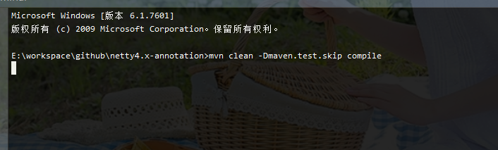
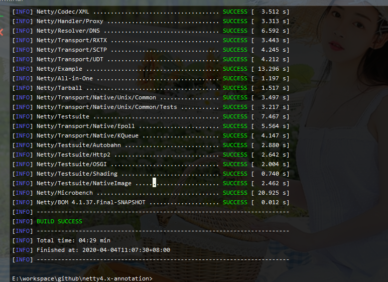

# Netty源码环境搭建

## 0、准备好环境

Java8 >

Maven 3>

IDEA

Git

## 1、Fork源码

GitHub地址：[netty](https://github.com/netty/netty)

> 强烈建议此源码fork到自己的仓库中，方便自己看源码时进行相关注释，也方便自己以后查看。

## 2、clone到本地

> 前提：安装好git

```shell
git clone https://github.com/roboslyq/netty4.x-annotation.git
```

## 3、导入IDEA

> 前提：配置好maven

这个就有很多方法了，比如先打开IDEA，然后打开第二步下载文件夹。或者直接找到项目根pom.xml，然后拖拽到IDEA中，打开之后就进入了漫长的等待阶段。请保证自己的网络畅通，因为maven需要从服务上下载很多相关依赖的jar包。

## 4、检查依赖

我们可以通过编译命令，来检查相关依赖是否已经完全导入正常：



如果正常运行上面的命令，最终输出大概如下：



但是很不幸，你不会成功的。因为netty的设置，你必须要进行下面这个报错解决。

## 5、解决依赖报错

在 codec-redis 模块中，类 FixedRedisMessagePool 会报如下**类不存在**的问题：

```java
import io.netty.util.collection.LongObjectHashMap;
import io.netty.util.collection.LongObjectMap;
```


跳转到 common 模块中，编译生成对应的类。

```shell
cd common;
mvn clean compile;
```

>  如果在上面compile时报相关依赖(dependency)找不到，则可以尝试在项目根目录执行上面的命令，对所有的相关模块进行相关编译。


为什么可以通过编译生成对应的类呢，原因参见 common 模块的 src/java/templates/io/netty/util/collection 目录下的 .template 文件。在 Github 上，也有多个针对这个情况讨论的 issue ：

[ https://github.com/netty/netty/issues/7518 ]( https://github.com/netty/netty/issues/7518 )

[ https://github.com/netty/netty/issues/5447 ]( https://github.com/netty/netty/issues/5447 )

## 6、Example测试

我们选择最熟悉的**Socket**模块进行相关的测试验证：`example\src\main\java\io\netty\example\socksproxy\SocksServer.java`

```java
/**
 * Socket通讯服务端Demo
 */
public final class SocksServer {

    static final int PORT = Integer.parseInt(System.getProperty("port", "1080"));

    public static void main(String[] args) throws Exception {
        //1、创建boss线程池(接收请求)
        EventLoopGroup bossGroup = new NioEventLoopGroup(1);
        //2、创建工作线程池(处理请求)，可以与bossGroup共用，但一般分开使用。
        EventLoopGroup workerGroup = new NioEventLoopGroup();
        try {
            //3、Nettty服务器启动包装类
            ServerBootstrap b = new ServerBootstrap();
            b.group(bossGroup, workerGroup)//设置线程池
                    .channel(NioServerSocketChannel.class)// 设置具体的通信协议类型;socket
                    .handler(new LoggingHandler(LogLevel.INFO))//设置boss相关的handler
                    .childHandler(new SocksServerInitializer());//设置worker相关的handler

            b.bind(PORT)  //绑定端口(启动服务)
                    .sync() //阻塞
                    .channel()
                    .closeFuture() //关闭channel
                    .sync();
        } finally {
            //优雅的关闭线程池
            bossGroup.shutdownGracefully();
            workerGroup.shutdownGracefully();
        }
    }
}
```


启动日志如下：

```verilog
17:52:19.161 [nioEventLoopGroup-2-1] INFO  i.n.handler.logging.LoggingHandler - [id: 0x0241c255] REGISTERED
17:52:19.225 [nioEventLoopGroup-2-1] INFO  i.n.handler.logging.LoggingHandler - [id: 0x0241c255] BIND: 0.0.0.0/0.0.0.0:1080
17:52:19.365 [nioEventLoopGroup-2-1] INFO  i.n.handler.logging.LoggingHandler - [id: 0x0241c255, L:/0:0:0:0:0:0:0:0:1080] ACTIVE
```

# 参考资料

[Netty源码环境搭建](https://blog.csdn.net/sanshengshui/article/details/82950497)

