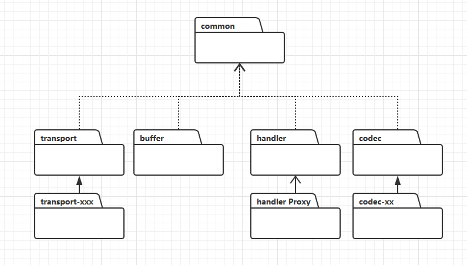

# Netty项目结构

> 关于网络编程的BIO,NIO,TCP,UDP等等相关的一系列基础知识网上有很多资料，在此就不一一说明了。

## 整体架构图

- **Core** ：核心部分，是底层的网络通用抽象和部分实现。
  
  - Extensible Event Model     ：可拓展的事件模型。Netty 是基于事件模型的网络应用框架。
  - Universal Communication API     ：通用的通信 API 层。Netty 定义了一套抽象的通用通信层的 API 。
  - Zero-Copy-Capable Rich Byte     Buffer ：支持零拷贝特性的 Byte Buffer 实现。
  
  > `Extensible Event Model` 和 `Universal Communication API` 具体源码实现为**transport**及具体子模块
  >
  > 
  >
  > `Zero-Copy-Capable Rich Byte Buffer` 由Buffer项目提供
  >
  > 

- **Transport     Services** ：传输(     通信 )服务，具体的网络传输的定义与实现。
  
  - Socket & Datagram ：TCP 和     UDP 的传输实现。
  - HTTP Tunnel ：HTTP 通道 (http隧道) 的传输实现。
- In-VM Piple ：JVM      (虚拟机内的管道) 
  
  > 具体实现也是由`transport`模块提供
  >
  > 
  
- **Protocol Support**: 通信协议的支持

  - Http & WebSocket : WebSocket是html基于http的全双工通信协议
  - SSL-Start-TLS:  (加密协议) 
  - Google Protobuf:  （google开源的序列化协议） 
  - zlib/gzip Compress:  (压缩格式) 
  - Large file transfer:  （支持大文件传输） 
  - RTSP ：  位于应用层的多媒体 实时流传输协议)（Real Time Streaming Protocol），RFC2326，实时流[传输协议](https://baike.baidu.com/item/传输协议)，是[TCP/IP协议](https://baike.baidu.com/item/TCP%2FIP协议)体系中的一个[应用层](https://baike.baidu.com/item/应用层)协议，由[哥伦比亚大学](https://baike.baidu.com/item/哥伦比亚大学/513683)、[网景](https://baike.baidu.com/item/网景/70176)和RealNetworks公司提交的IETF RFC标准。该协议定义了一对多应用程序如何有效地通过[IP网络](https://baike.baidu.com/item/IP网络)传送多媒体数据。RTSP在[体系结构](https://baike.baidu.com/item/体系结构/8174145)上位于RTP和RTCP之上，它使用TCP或UDP完成数据传输。 
  -  Legacy Text.Binary Protocols with Unit Testability :  (传统的文本。具有单元可测试性的二进制协议) 

  > 具体实现由`codec`模块提供
  >
  > 

## 项目说明

- **all**
  
  - All - in - one 定义
  
- **bom**
  
  - Netty Bill Of Materials 的缩写，详情可以参考链接[《Maven 与Spring BOM( Bill Of Materials )简化 Spring 版本控制》](https://blog.csdn.net/fanxiaobin577328725/article/details/66974896)
  
- **buffer**
  
  - `Zero-Copy-Capable Rich Byte Buffer` 的具体实现。直译过来可以理解为`缓冲区`。因为`NIO`编程是面向Channel-Buffer编程的。我们不能直接往`Channel`直接读写数据，必须通过`Buffer`。
  
- **codec**
  
  对各种协议(协议指规定了通讯数据格式)实现
  
  - codec-dns
    - 对Dns支持
  - codec-haproxy
    - 对HAproxy支持
  - codec-http
    - 对Http的支持
  - codec-http2
    - 对Http2协议支持
  - codec-memcache
    - 对memcache支持
  - codec-mqtt
    - 对mqtt支持：MQTT**(**消息队列遥测传输)是ISO 标准(ISO/IEC PRF 20922)下基于发布/订阅范式的消息协议。它工作在[TCP/IP协议族](https://baike.baidu.com/item/TCP%2FIP协议族)上，是为硬件性能低下的远程设备以及网络状况糟糕的情况下而设计的发布/订阅型消息协议，为此，它需要一个[消息中间件](https://baike.baidu.com/item/消息中间件)。
  - codec-redis
    - 对redis支持
  - codec-smtp
    - 对smtp支持(流媒体)
  - codec-socks
    - 对socket支持
  - codec-stomp
    - 对stomp协议支持：STOMP即Simple (or Streaming) Text Orientated Messaging Protocol，简单(流)文本定向消息协议，它提供了一个可互操作的连接格式，允许STOMP客户端与任意STOMP消息代理（Broker）进行交互。STOMP协议由于设计简单，易于开发客户端，因此在多种语言和多种平台上得到广泛地应用。
  - codec-xml
    - 对xml的编解码支持

- **common**

  - 通用包，所有的netty自身封装的通用工具。其它项目均会依赖于这个模块。

- dev-tools

  - 空项目

- docker

  - docket相关

- **example**

  - 最完整的整个netty的相关示例。

- **handler**

  内置的连接通道处理器( ChannelHandler )实现类。例如：SSL 处理器、日志处理器等等。

  - **handler-proxy**
    - 实现对 HTTP、Socks 4、Socks 5 的代理转发。

- microbench

  - 微基准测试

- resolver

  终端( Endpoint ) 的地址解析器。

  - resolver-dns

- tarball

  All In One 打包工具。

- testsuite

  > Junit有这样的情景：有两个测试类，
  > TestCase1 和 TestCase2 （或者更多：TestCase3，TestCase4.。。）
  >
  > TestSuite使用背景：如果有很多工具类需要被测试，那么就会有 TestCase2, TestCase3, TestCase4,要挨个去执行这些单独的测试类，也是比较麻烦的，所以就有了 TestSuite的概念。
  >
  > TestSuite作用：执行多个测试类。（执行TestCase1 和 TestCase2 ，TestCase3，TestCase4.。。）

  - testsuite-autobahn
  - testsuite-http2
  - testsuite-native-image
  - testsuite-osgi
  - testsuite-shading

- **transport**

  netty的最底层核心项目，实现了 Netty 架构图中 Transport Services、Universal Communication API 和 Extensible Event Model 等多部分内容。该项目是网络传输通道的抽象和实现。它定义通信的统一通信 API ，统一了 JDK 的 OIO、NIO ( 不包括 AIO )等多种编程接口。

  > Netty为什么不包括AIO?
  >
  > 简单一句话：费力不讨好。即使用AIO在性能上没有多大提供，并且实现较复杂。当前NIO性能已经很好并且很稳定了。没有必要再实现AIO。

  - transport-native-epoll
  - transport-native-kqueue
  - transport-native-unix-common
  - transport-native-unix-common-tests
  - transport-rxtx
  - transport-sctp
  - transport-udt

## 项目依赖关系

其实Netty的项目依赖关系十分清晰明了。首先，是一个common通用包，里面集成了一些基本工具。其它所有项目均依赖此模块。然后Netty分为4个主要模块;

- Transport

  - 底层的通信实现

- buffer

  - 缓存实现

- handler

  - Netty的ChannelPipe模式提供的内置Handler

- codec

  - Netty编码解码实现

  