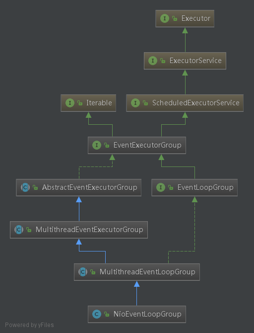

[TOC]

# 1 Netty服务端启动

> 我觉得在看这个源码之前 ，必须要自己去了解一下netty的工作流程，线程模块等相关的基础知识是很有必要。关于这些基础知识网上的文章很多，在此我不会对这些知识进行过多的讲解。本章节主要是针对Netty服务端启动流程相关的源码进行讲解。

## 1.1 DEMO源码

讲解服务端启动流程，我们需要一个入口。我觉得这个入口就是Netty自带的`example`模块里的`echo`部分。此部分代码虽然简单，但是基本上能描述清楚创建一个服务的过程。所谓麻雀虽小，五脏俱全。

`EchoServer`部分代码如下：（非关键代码已经删除）

```java
package io.netty.example.echo;
public final class EchoServer {
    //定义端口
    static final int PORT = Integer.parseInt(System.getProperty("port", "8007"));
    
    public static void main(String[] args) throws Exception {
        // Configure the server.
        // 初始化用于Acceptor的主"线程池"以及用于I/O工作的从"线程池"；
        EventLoopGroup bossGroup = new NioEventLoopGroup(1);
        //设置工作线程池
        EventLoopGroup workerGroup = new NioEventLoopGroup();
        // 创建Handler
        final EchoServerHandler serverHandler = new EchoServerHandler();
        try {
            // Netty封装的方便服务端启动的引导类
            ServerBootstrap b = new ServerBootstrap();
            // 设置Reactor线程组
            b.group(bossGroup, workerGroup)
                //设置Channel类型
             .channel(NioServerSocketChannel.class)
                //设置可选参数
             .option(ChannelOption.SO_BACKLOG, 100)
                //设置Reactor主线程组Handler
             .handler(new LoggingHandler(LogLevel.INFO))
                //设置Reactor从线程组Handler
             .childHandler(new ChannelInitializer<SocketChannel>() {
                 // 在每一个Channel创建时，初始化ChannelPipeline
                 @Override
                 public void initChannel(SocketChannel ch) throws Exception {
                     ChannelPipeline p = ch.pipeline();
                     if (sslCtx != null) {
                         p.addLast(sslCtx.newHandler(ch.alloc()));
                     }
                     //p.addLast(new LoggingHandler(LogLevel.INFO));
                     p.addLast(serverHandler);
                 }
             });
            // Start the server.启动服务并阻塞
            ChannelFuture f = b.bind(PORT).sync();
            // Wait until the server socket is closed.
            f.channel().closeFuture().sync();
        } finally {
            // Shut down all event loops to terminate all threads.
            //优雅的关闭服务
            bossGroup.shutdownGracefully();
            workerGroup.shutdownGracefully();
        }
    }
}

```

### 1.1.1 创建NioEventLoopGroup

EventLoop如同它的名字，它是一个无限循环（Loop），在循环中不断处理接收到的事件（Event）。而EventLoopGroup即一个事件监听组，对应一个线程组。

> EventLoop: 翻译过来就是事件循环器，即不断的循环监听相应的事件(IO事件)。
>
> NioEventLoop：即NIO的事件循环监听器
>
> NioEventLoopGroup：NIO事件循环监听器组，即包含一组NioEventLoop，可以对其进行相关调度。

​	注释(1)处，这个服务端Reactor模型的实现。其中上面代码中的bossGroup就是主从Reactor模型中的主线程组,workerGroup就是从线程组。关于具体的三种线程模型：单线程模型，多线程模型，多线程主人模型可以上网查阅相关资料，此处不作详细说明。

##### 类继承关系



- 首先，最顶层的接口是`Executor`,因此有执行一个任务(Runnable)的能力
- 其次，继承了`ScheduledExecutorService`，因此有延迟、定时执行任务的能力。
- 再次，还继承`Itreable`遍列接口，因此有遍列的能力，可以可以通过`netxt()`方法实现`NioEventLoop`的遍列。
- 最后，它继承了`MultiThreadEventLoopGroup`，因此具有多线程的能力。