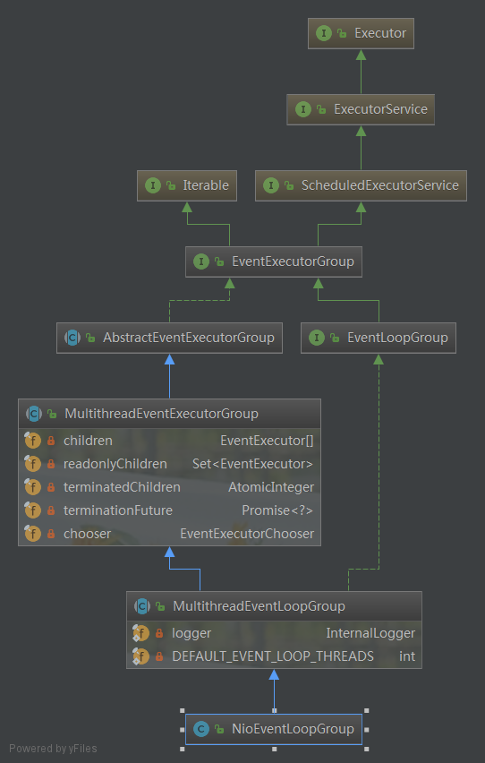
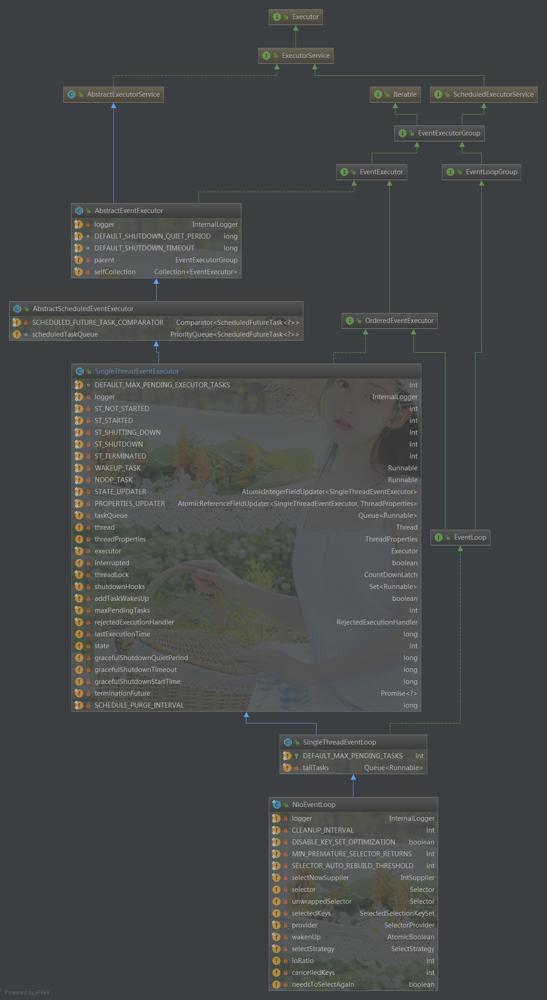
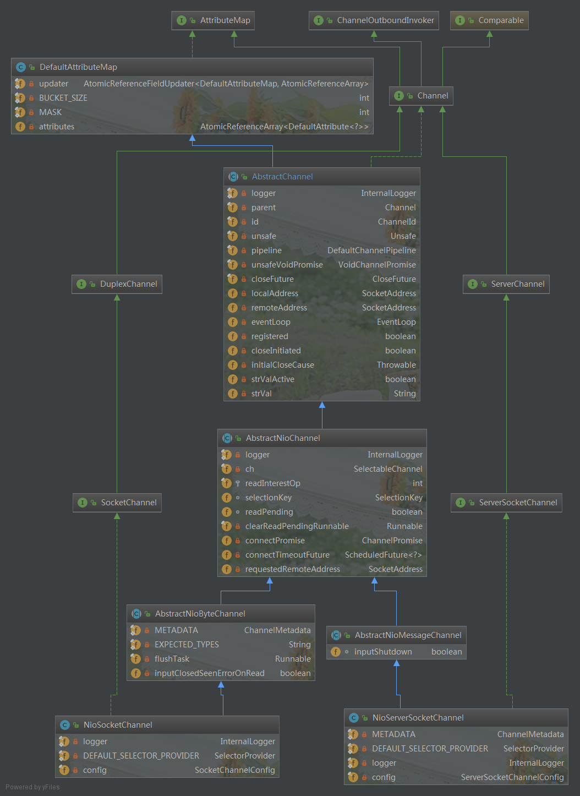
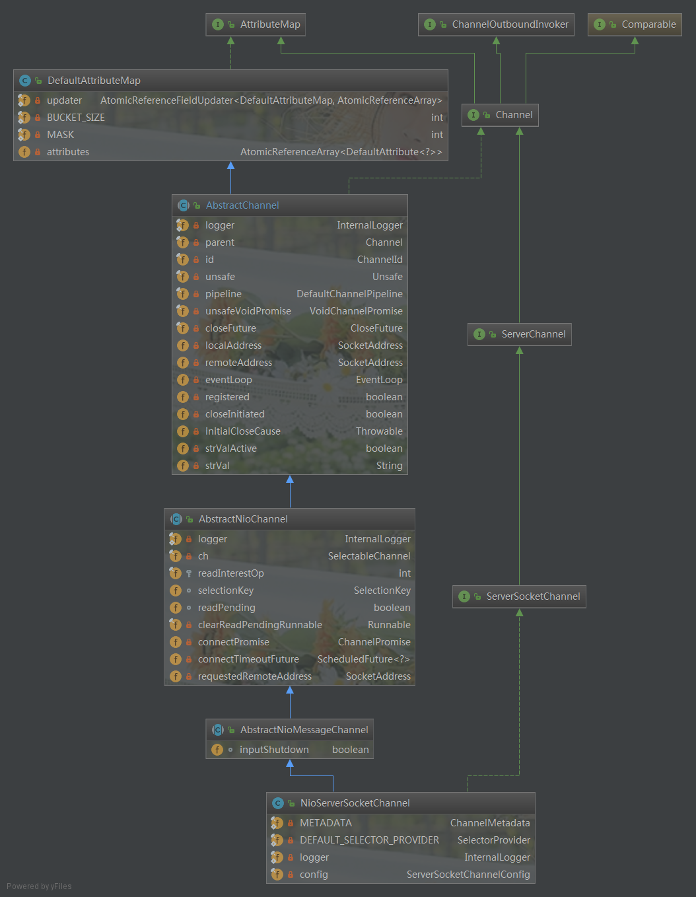
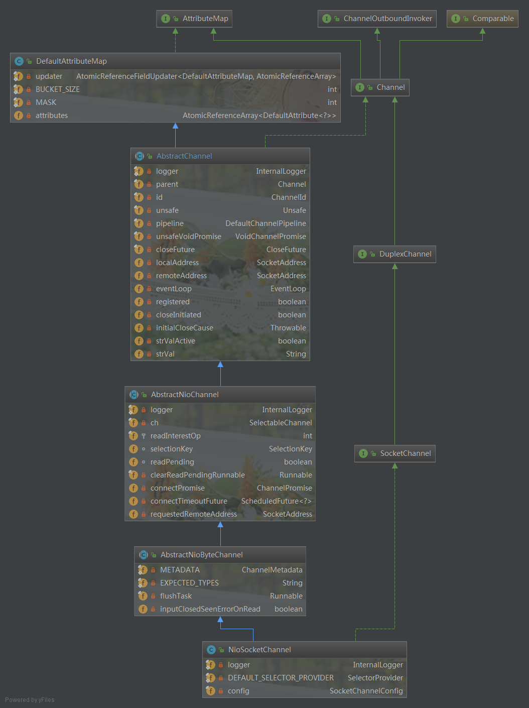
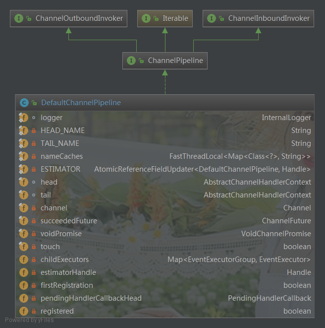
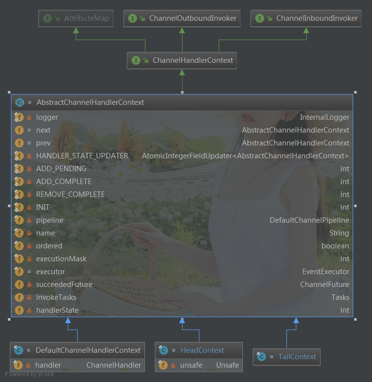
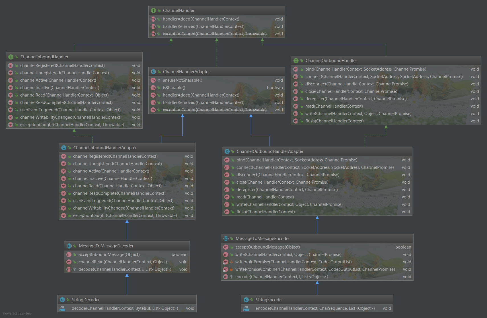

# Netty核心组件简介

# 1. NioEventLoopGroup



- **EventExecutor[] children**

  - 此属性真实类型为"NioEventLoop"，即NioEventLoopGroup线程组的具体线程。

  - 在NioEventLoopGroup构造函数中进行初始化。

    ```java
     protected MultithreadEventExecutorGroup(int nThreads, Executor executor,
                                                EventExecutorChooserFactory chooserFactory, Object... args) {
            if (nThreads <= 0) {
                throw new IllegalArgumentException(String.format("nThreads: %d (expected: > 0)", nThreads));
            }
            // 初始化 任务执行器: ThreadPerTaskExecutor
            if (executor == null) {
                executor = new ThreadPerTaskExecutor(newDefaultThreadFactory());
            }
            children = new EventExecutor[nThreads];
            // 服务端启动时，对应的具体实现类为NioEventLoopGroup，初始化具体线程NioEventLoop
            for (int i = 0; i < nThreads; i ++) {
                boolean success = false;
                try {
                    // 如果是NioEventLoopGroup，则进行NioEventLoopGroup.newChild()方法中。
                    children[i] = newChild(executor, args);
                    success = true;
                } catch (Exception e) {
                    // TODO: Think about if this is a good exception type
                    throw new IllegalStateException("failed to create a child event loop", e);
                } finally {
                   
            }
    
            chooser = chooserFactory.newChooser(children);
            final FutureListener<Object> terminationListener = new FutureListener<Object>() {
                @Override
                public void operationComplete(Future<Object> future) throws Exception {
                    if (terminatedChildren.incrementAndGet() == children.length) {
                        terminationFuture.setSuccess(null);
                    }
                }
            };
    
            for (EventExecutor e: children) {
                e.terminationFuture().addListener(terminationListener);
            }
    
            Set<EventExecutor> childrenSet = new LinkedHashSet<EventExecutor>(children.length);
            Collections.addAll(childrenSet, children);
            readonlyChildren = Collections.unmodifiableSet(childrenSet);
        }
         
         /**
         * 实例化具体的NioEventLoop线程。
         * @param executor ThreadPerTaskExecutor
         * @param args args[0] = 在windows下为WindowsSelectorProvider
         *             args[1] = DefaultSelectStrategyFactory
         *             args[1] = RejectedExecutionHandler
         * @return
         * @throws Exception
         */
        @Override
        protected EventLoop newChild(Executor executor, Object... args) throws Exception {
            return new NioEventLoop(this, executor, (SelectorProvider) args[0],
                ((SelectStrategyFactory) args[1]).newSelectStrategy(), (RejectedExecutionHandler) args[2]);
        }
    ```


# 2. NioEventLoop



> 注意一个关键点：此`EventLoop`中没有包含具体的`Channel`信息，而是`Channel`中包含具体的`EventLoop`。因此 ，一个EventLoop可以为多个Channel执行相关的任务。即`EventLoop`:`Channel` = N : 1的关系。

- **Selector selector**

  - 当前`EventLoop`对应监听的具体Selector
- **SelectedSelectionKeySet selectedKeys**
- **Thread thread**
- 当前`NioEventLoop`对应的执行线程。一个EventLoop与一个Thread绑定，因此，可以认为，EventLoop就是一个线程。
- **EventExecutorGroup parent**

  - 真实类型是`NioEventLoopGroup`
- **Queue<Runnable>  taskQueue**
- 任务队列
- **Executor executor**
- 任务执行器

> NioEventLoop 是 Netty 的 Reactor 线程，它的职责如下：
>
> 1. 作为服务端 Acceptor 线程，负责处理客户端的请求接入(Acceptor)；
> 2. 作为客户端 Connecor 线程，负责注册 监听连接操作位，用于判断异步连接结果；
> 3. 作为 IO 线程，监听网络读操作位，负责从 SocketChannel 中读取报文；
> 4. 作为 IO 线程，负责向 SocketChannel 写入报文发送给对方，如果发生写半包，会自动注册监听写事件，用于后续继续发送半包数据，直到数据全部发送完成；
> 5. 作为定时任务线程，可以执行定时任务，例如链路空闲检测和发送心跳消息等；
> 6. 作为线程执行器可以执行普通的任务线程（Runnable）。

# 3. Channel

`Channel`类型主要有两上：服务端NioServerSocketChannel和客户端NioSocketChannel



## 3.1 NioServerSocketChannel

在ServerBootStrap启动时，完成初始化。`ServerBootStrap.bind()`--> `AbstractBootStrap.initAndRegister() `中，通过`channelFactory`反射完成Instance创建。

```java
final ChannelFuture initAndRegister() {
        Channel channel = null;
        try {
            //channelFactory = ReflectiveChannelFactory: 通过反射实例化channel
            channel = channelFactory.newChannel();
            //初始化channel<配置相关配置>
            init(channel);
        } catch (Throwable t) {
            if (channel != null) {
                channel.unsafe().closeForcibly();
                return new DefaultChannelPromise(channel, GlobalEventExecutor.INSTANCE).setFailure(t);
            }
            return new DefaultChannelPromise(new FailedChannel(), GlobalEventExecutor.INSTANCE).setFailure(t);
        }
        /*
         * 注册 Channel 到 EventLoopGroup 中：即将Channel（NioServerSocketChannel）注册到Reactor主线程中。
         *  config.group() = EventLoopGroup ,具体实例为MultithreadEventLoopGroup
         *  config().group().registrer()  = MultithreadEventLoopGroup.registrer()
         */
        ChannelFuture regFuture = config().group().register(channel);
        if (regFuture.cause() != null) {
            if (channel.isRegistered()) {
                channel.close();
            } else {
                channel.unsafe().closeForcibly();
            }
        }
        return regFuture;
    }
```




- **ServerSocketChannelConfig config**

- **EventLoop eventloop**
  - 当前服务端Channel绑定的EventLoop
- **DefaultChannelPipeline pipeline**
- **Unsafe unsafe**
- **Parent parent**
  - NioServerSocketChannel的parent为Null
- **SelectionKey selectionKey**

## 3.2.  NioSocketChannel

在客户端起连接时，进行初始化。



>  NioSocketChannel 与NioServerSocketChannel拥有相同的继承体系

- **SocketChannelConfig config**
  - 客户端的相关配置

- **EventLoop eventloop**
  - 为客户端Eventloop,即workGroup线程组中具体干活的EventLoop。
- **DefaultChannelPipeline pipeline**
  - 此值是SocketChannelPipeline，非ServerSocketChannelPipeline.通过Bootstrap.childHandler()设置。
- **Unsafe unsafe**
  - 具体的SocketChannel对应的unsafe
- **Parent parent**
  - 当为 NioSocketChannel 时，parent为NioServerSocketChannel.
- **SelectionKey selectionKey**
  - 具体的客户端对应的SelectionKey


# 5. ChannelPipeline



> 在DefaultChannelPipeline中没有发现ChannelHandler数组，或者ChannelHandler链表等结构，那么是怎么构建成链的呢？答案就在head 和 tail对应的**AbstractChannelHandlerContext **中

- **AbstractChannelHandlerContext head**
- **AbstractChannelHandlerContext tail**
- **Channel channel**
  - 表明，一个ChannelPipeline对应一个Channel。即每个Channel有自己独立的ChannelPipeline
- **Map<EventExecutorGroup,EventExecutor> childExecutors**
  - TODO

# 6. ChannelHandlerContext



- **ChannelHandler handler**
  - 当前ChannelHandlerContext对应的Channel
- **DefaultChannelPipeline pipe**
  - 保存当前Channel对应的pipeline 

- **AbstractChannelHandlerContext next**
  - 构成ChannelHandler链的当前节点前一元素
- **AbstractChannelHandlerContext prev**
  - 构成ChannelHandler链的当前节点下一元素

# 7. ChannelHandler



> ChannelHandler比较特殊，主要是针对具体的业务场景，所以基本没有什么公共的属性。因此我就列出一些通用的方法。因此上图中仅举出两个小例子:StringDecoder 和 StringEncoder

- **StringDecoder** 和**StringEncoder**
  - 此类有一个特点，入参基本都是`ChannelHandlerContext`。因此


# 8. 依赖关系汇总


# 9、问题

## 9.1 BossGroup是否有必要多线程？

正常情况，没有必要，设置为1即可。但是存在一种共享`ServerBootstrap`情况，示例代码如下:

```java
public class EchoServer {

private final int port;
private List<ChannelFuture> channelFutures = new ArrayList<ChannelFuture>(2);

public EchoServer(int port) {
    this.port = port;
}

public void start() throws Exception {
	// 定义好线程组
    EventLoopGroup bossGroup = new NioEventLoopGroup(1);
    EventLoopGroup workerGroup = new NioEventLoopGroup(4);
	// 循环两次，创建两个不同的ServerBootStrap,监听不同的端口
    for (int i = 0; i != 2; ++i) {
        ServerBootstrap b = new ServerBootstrap();
        b.group(bossGroup, workerGroup)
                .channel(NioServerSocketChannel.class) // the channel type
                .childHandler(new ChannelInitializer<SocketChannel>() {
                    @Override
                    public void initChannel(SocketChannel ch)
                            throws Exception {
                        System.out.println("Connection accepted by server");
                        ch.pipeline().addLast(
                                new EchoServerHandler());
                    }
                });

        // wait till binding to port completes
        ChannelFuture f = b.bind(port + i).sync();
        channelFutures.add(f);
        System.out.println("Echo server started and listen on " + f.channel().localAddress());
    }

    for (ChannelFuture f : channelFutures)
        f.channel().closeFuture().sync();

    // close gracefully
    workerGroup.shutdownGracefully().sync();
    bossGroup.shutdownGracefully().sync();
}

public static void main(String[] args) throws Exception {
    if (args.length != 1) {
        System.err.println(
                "Usage: " + EchoServer.class.getSimpleName() +
                        " <port>");
        return;
    }
    int port = Integer.parseInt(args[0]);
    new EchoServer(port).start();
}
```

>  1个线程的bossGroup和具有4个线程的workerGroup,并将两个事件组共享到绑定到两个不同端口(例如9000和9001)的两个不同的bootstrap.

最佳答案

> the creator of Netty says multiple boss threads are useful if we share
> NioEventLoopGroup between different server bootstraps, but I don’t see
> the reason for it.

正如Norman Maurer所说,这没有必要,但它非常有用.

如果您使用1个线程进行2个不同的bootstrap,则意味着您无法同时处理与此bootstraps的连接.所以在非常糟糕的情况下,当boss线程只处理一个引导程序的连接时,永远不会处理与另一个引导程序的连接.

对于工作者EventLoopGroup也是如此.

参考资料:  http://ddrv.cn/a/302336 

## 9.2  Java NIO 经典BUG是什么原因导致的？怎么解决？

边缘触发，CPU空转，使用率100%。

## 9.3 netty中eventloop线程和客户端管道的绑定是怎么实现的?
netty通过java.nio.channels.SelectableChannel#register(java.nio.channels.Selector, int, java.lang.Object)方法将自身实现的NioSocketChannel和SelectionKey,原生的socket channel绑定在了一起.
NioSocketChannel(AbstractNioChannel.NioUnsafe负责创建)在初始化过程中(由ServerBootstrapAcceptor负责添加pipeline等)时会设置eventloop变量的,
这样每次selectionkey事件触发就知道是哪个niosocketchannel,然后就知道了eventloop(执行线程).

参考资料：http://xueliang.org/article/detail/20200712234015993

https://blog.csdn.net/mydream20130314/article/details/84501060

## 9.4 netty为什么将ACCEPT事件和普通READ事件放一起处理？

```java
if ((readyOps & (SelectionKey.OP_READ | SelectionKey.OP_ACCEPT)) != 0 || readyOps == 0) {
    // 核心的常用方法===> 读事件处理
    // 当事件为OP_ACCEPT时(即ch为Server端:NioServerSocketChannel)，unsafe = AbstractNioMessageChannel#NioMessageUnsafe
    // 当事件为OP_READ时(即ch为Client端:NioSocketChannel)，unsafe = AbstractNioByteChannel#NioByteUnsafe
    // 入站步骤：OP_ACCEPT_1
    unsafe.read();
}
```

即不同的Channel（NioServerSocketChannel和NioSockerChannel）对应不同的Unsafe。

如果是服务端监听NioServerSocketChannel，则unsafe = AbstractNioMessageChannel#NioMessageUnsafe,此时对应ACCEPT处理。

如果是客户端发送消息的端监听NioSocketChannel，则unsafe = AbstractNioMessageChannel#NioByteUnsafe,此时对应READ事件处理。